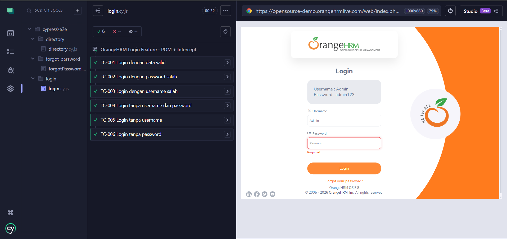
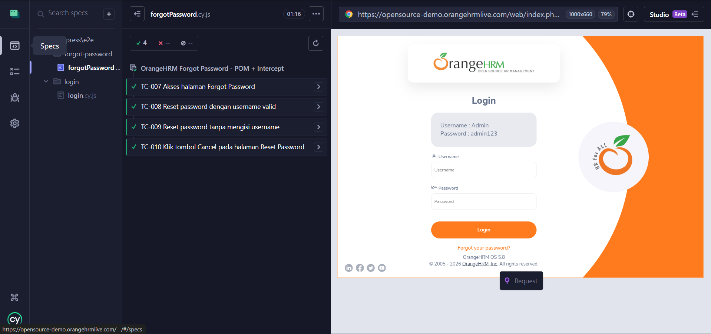
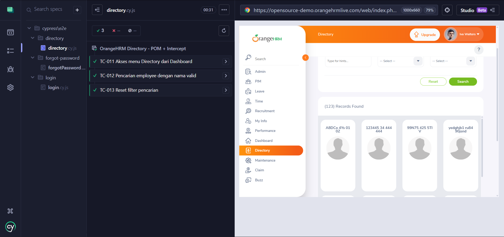

# FINAL PROJECT QA -- Automation Testing with Cypress

Project ini merupakan automation testing menggunakan **Cypress** untuk
melakukan pengujian fitur Login, Forgot Password, dan Directory.

## Author 

Nama: Acep Handika Permana\
Role: Quality Assurance

## Struktur Project

    cypress/
    │
    ├── e2e/
    │   ├── login/
    │   │   └── login.cy.js
    │   ├── forgot-password/
    │   │   └── forgotPassword.cy.js
    │   └── directory/
    │       └── directory.cy.js
    │
    ├── fixtures/
    │   ├── loginData.json
    │   ├── forgotPasswordData.json
    │   └── directoryData.json
    │
    ├── pages/
    │   ├── LoginPage.js
    │   ├── ForgotPasswordPage.js
    │   └── DirectoryPage.js
    │
    ├── support/
    │   ├── commands.js
    │   └── e2e.js
    │
    cypress.config.js
    package.json

Project menggunakan:
- Cypress
- Page Object Model (POM)
- Fixtures (Test Data terpisah)
- Intercept (cy.intercept) untuk validasi API request & response

## Daftar Test Case

### Login
-   TC-001 Login dengan data valid
-   TC-002 Login dengan password tidak valid
-   TC-003 Login dengan username tidak valid
-   TC-004 Login tanpa username dan password
-   TC-005 Login tanpa username
-   TC-006 Login tanpa password

### Forgot Password
-   TC-007 Akses halaman Forgot Password
-   TC-008 Reset password dengan username valid
-   TC-009 Reset password tanpa mengisi username
-   TC-010 Klik tombol Cancel pada halaman Reset Password

### Directory

-   TC-011 Akses menu Directory dari Dashboard
-   TC-012 Pencarian employee dengan nama valid
-   TC-013 Reset filter pencarian

## Screenshot Evidence

### Screenshoot Fitur Login

### Screenshoot Forgot Password

### Screenshoot Fitur Directory

